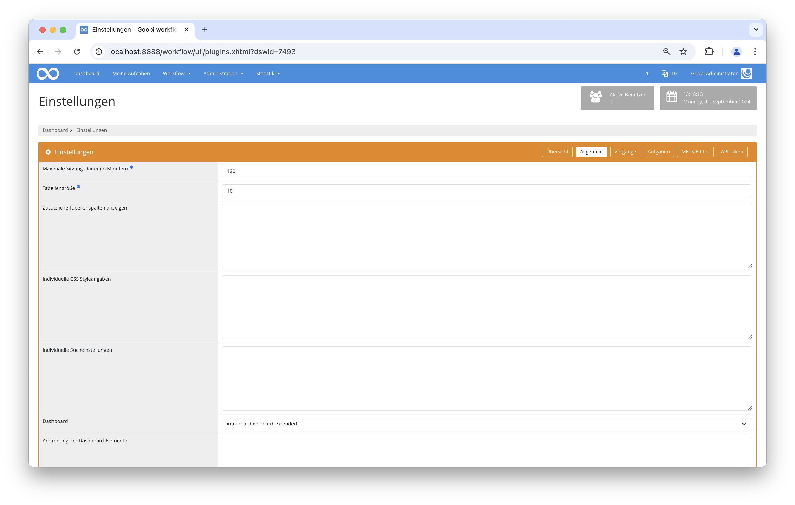
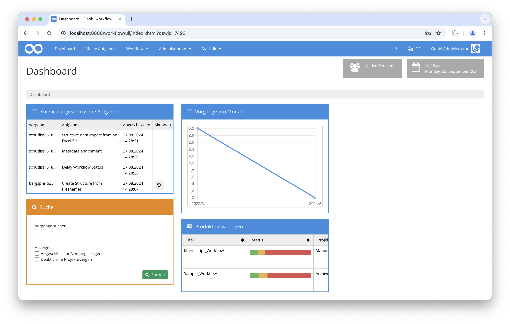

## Einführung
Dieses Dashboard Plugin ermöglicht durch eine detaillierte Darstellung einen verbesserten Überblick. Es können beispielsweise die zuletzt bearbeiteten Aufgaben oder relevante Statistiken angezeigt werden.

## Installation
Um das Plugin nutzen zu können, müssen folgende Dateien installiert werden:

```bash
/opt/digiverso/goobi/plugins/dashboard/plugin-dashboard-extended-base.jar
/opt/digiverso/goobi/plugins/GUI/plugin-dashboard-extended-gui.jar
/opt/digiverso/goobi/config/plugin_intranda_dashboard_extended.xml
```

Für eine Nutzung dieses Plugins muss der Nutzer innerhalb der Einstellungen für das Dashboard den Wert `intranda_dashboard_extended` auswählen. 




## Überblick und Funktionsweise
Wenn das Plugin korrekt installiert ist und Nutzer sich dieses als Dashboard eingestellt haben, ist es nach dem Login in Goobi workflow anstelle der Startseite sichtbar.



## Konfiguration
Die Konfiguration des Plugins erfolgt in der Datei `plugin_intranda_dashboard_extended.xml` wie hier aufgezeigt:

{{CONFIG_CONTENT}}

Die folgende Tabelle enthält eine Zusammenstellung der Parameter und ihrer Beschreibungen:

Parameter               | Erläuterung
------------------------|------------------------------------
`<itm-show>`            | Dieser Parameter legt fest, ob die aktuell laufenden Jobs des intranda Task Managers angezeigt werden sollen. 
`<itm-cache-time>`      | Dieser Wert wird in Millisekunden angegeben und legt fest, wie oft die Werte aus dem intranda Task Manager aktualisiert werden sollen.
`<itm-url>`             | Hier wird die URL angegeben, unter der der intranda Task Manager erreichbar ist.
`<rss-show>`            | Dieser Parameter legt fest, ob Neuigkeiten angezeigt werden sollen, die per RSS-Feed abgefragt werden können.
`<rss-cache-time>`      | Dieser Wert wird in Millisekunden angegeben und gibt an, wie oft der RSS-Feed aktualisiert werden soll.
`<rss-url>`             | Dieser Paramter legt fest, von welcher Webseite der RSS-Feed geladen werden soll.
`<rss-title>`           | Hier wird der Titel festgelegt, der über den Neuigkeiten stehen soll.
`<search-show>`         | Dieser Parameter legt fest, ob das `Suche`-Formular angezeigt werden soll.
`<tasks-show>`          | Dieser Parameter legt fest, ob der Bereich `Kürzlich abgeschlossene Aufgaben` angezeigt werden soll.
`<tasks-show-size>`     | Hier wird festgelegt, wie viele der kürzlich abgeschlossenen Aufgaben angezeigt werden sollen.
`<tasks-history>`       | Hiermit kann man sich den Verlauf der letzten Aufgaben anzeigen lassen. 
`<tasks-history-title>` | Mithilfe dieses Parameters kann festgelegt werden, welcher Aufgabentyp angezeigt werden soll.
`<tasks-history-period>` | Dieser Parameter legt fest, wie lange die letzte Bearbeitung maximal zurückliegen darf (in Tagen), damit diese noch angezeigt wird. |
`<tasks-latestChanges>` | Hier kann festgelegt werden, ob die zuletzt bearbeiteten Aufgaben angezeigt werden sollen.
`<tasks-latestChanges-size>` | Dieser Parameter gibt die Anzahl der letzten zu zeigenden Änderungen an.
`<statistics-show>`     | Hier wird definiert, ob Statistiken angezeigt werden sollen.
`<batches-show>`        | Dieser Parameter gibt, ob die `Batches` angezeigt werden sollen.
`<batches-timerange-start>` | Hier wird festgelegt, vor wie vielen Monaten die Batches angefangen wurden zu bearbeiten, damit diese angezeigt werden.
`<batches-timerange-end>` | Hier wird festgelegt, wie vielen Monate nach Beginn der Bearbeitung die Batches angezeigt werden.
`<processTemplates-show>` | Dieser Parameter legt fest, ob die Produktionsvorlagen angezeigt werden sollen.
`<processTemplates-show-statusColumn>` | Hier wird festgelegt, ob die Status-Spalte angezeigt werden soll.
`<processTemplates-show-projectColumn>` | Hier wird festgelegt, ob die Projekt-Spalte angezeigt werden soll.
`<processTemplates-show-massImportButton>` | Hier wird festgelegt, ob der Massenimport-Button angezeigt werden soll.
`<queue-show>`.           | Dieser Parameter legt fest, ob im Dashboard angezeigt werden soll, wie viele Vorgänge gerade in der Warteschlange sind und in welchem Status sie sich befinden.