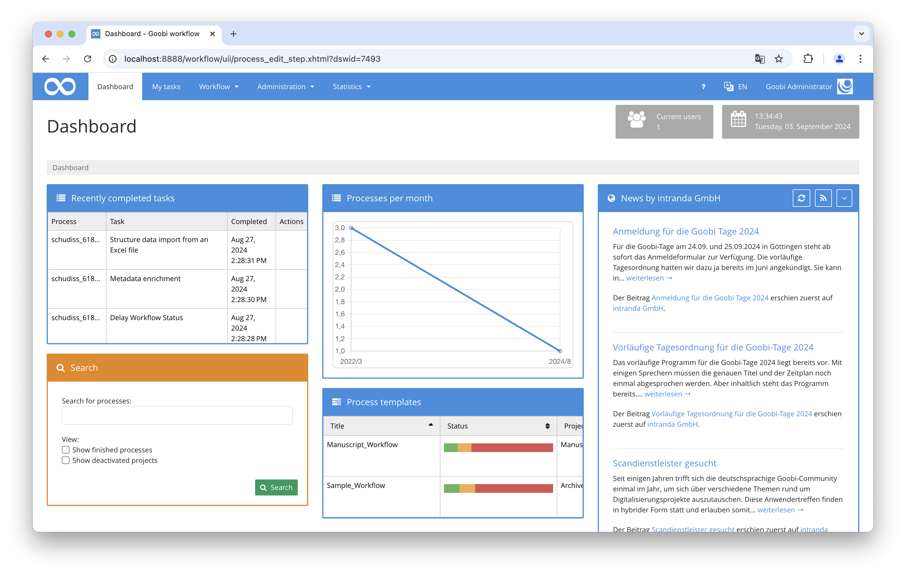

## Introduction
This dashboard plugin provides an improved overview through detailed display options. For example, the most recently edited tasks or relevant statistics can be shown.

## Installation
In order to use the plugin, the following files must be installed:

```bash
/opt/digiverso/goobi/plugins/dashboard/plugin-dashboard-extended-base.jar
/opt/digiverso/goobi/plugins/GUI/plugin-dashboard-extended-gui.jar
/opt/digiverso/goobi/config/plugin_intranda_dashboard_extended.xml
```

To use this plugin, the user must select the value `intranda_dashboard_extended` within the dashboard settings. 


## Overview and functionality
If the plugin is installed correctly and users have set it as their dashboard, it will be visible after logging into Goobi workflow instead of the start page.



## Configuration
The plugin is configured in the file `plugin_intranda_dashboard_extended.xml` as shown here:

{{CONFIG_CONTENT}}

The following table contains a summary of the parameters and their descriptions:

Parameter               | Explanation
------------------------|------------------------------------
`<itm-show>`                              | This parameter determines whether tasks within the Intranda Task Manager should be displayed.|
`<itm-cache-time>`                        | This value is specified in milliseconds and indicates how long it takes for the values from the Intranda Task Manager to be reloaded. | 
`<itm-url>`                               | Here, the URL where the Intranda Task Manager is accessible is specified.|
`<rss-show>`                              | This parameter determines whether news should be displayed. | 
`<rss-cache-time>`                        | This value is specified in milliseconds and indicates how long it takes for the news to be reloaded. |
`<rss-url>`                               | This parameter specifies from which website the news should come. | 
`<rss-title>`                             |Here, the title displayed above the news is set. | 
| `<search-show>`                         | This parameter determines whether the `Search` field should be displayed. |
| `<tasks-show>`                          | This parameter determines whether the `Recently completed tasks` field should be displayed. |
| `<tasks-show-size>`                     | Here you can specify how many of the recently completed tasks should be displayed. |
| `<tasks-history>`                       | This allows you to display the history of the last tasks. |
| `<tasks-history-title>`                 | With this parameter, you can specify which task type should be displayed. |
| `<tasks-history-period>`                | This parameter defines how long ago the last edit can be (in days) for it to still be displayed. |
| `<tasks-latestChanges>`                 | Here you can specify whether the most recently edited tasks should be displayed. |
| `<tasks-latestChanges-size>`            | This parameter specifies the number of recent changes to be shown. |
| `<statistics-show>`                     | Here it is defined whether statistics should be displayed. |
| `<batches-show>`                        | This parameter specifies whether the `Batches` should be displayed. |
| `<batches-timerange-start>`             | Here you can specify how many months ago the batches must have started being processed for them to be displayed. | 
| `<batches-timerange-end>`               | Here you can specify how many months after the start of processing the batches should be displayed. |
| `<processTemplates-show>`               | This parameter determines whether the production templates should be displayed. |
| `<processTemplates-show-statusColumn>`  | Here you can specify whether the status column should be displayed. |
| `<processTemplates-show-projectColumn>` | Here you can specify whether the project column should be displayed. |
| `<processTemplates-show-massImportButton>` | This parameter determines whether the mass import button should be displayed. |
| `<queue-show>`                          | This parameter determines whether the dashboard should display how many processes are currently in the queue and are either waiting or being processed. | 